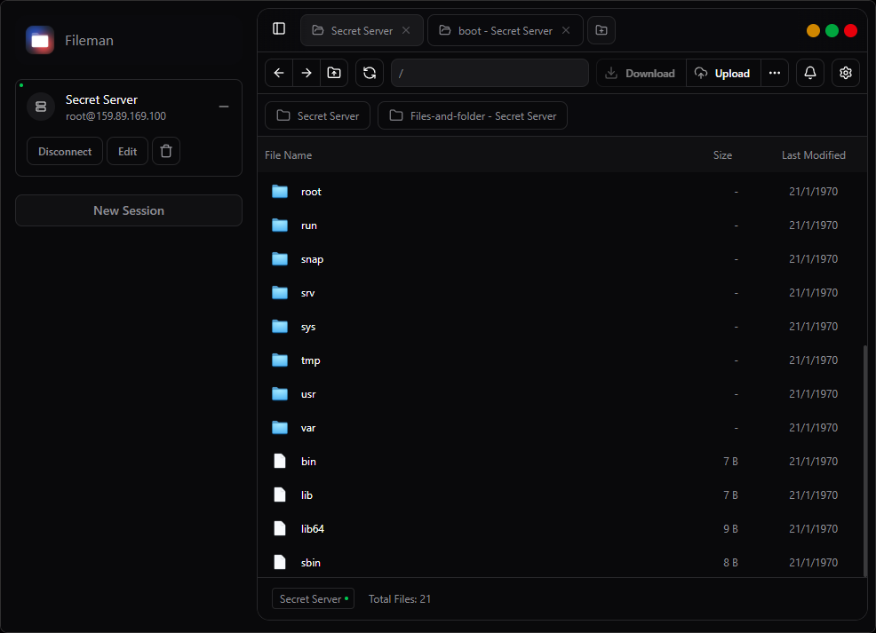

# Fileman

Fileman is a modern file manager application built with Tauri and React. It provides a user-friendly interface for managing files and directories on your SFTP server, with features like file upload, download, and directory navigation.




## Features

- **SFTP Support**: Connect to your SFTP server and manage files securely.
- **File Upload**: Easily upload files to your server.
- **File Download**: Download files from your server to your local machine.
- **Directory Navigation**: Navigate through directories with ease.
- **File Operations**: Perform basic file operations like info, rename.
- **Dark Mode**: Enjoy a sleek dark mode interface.
- **Responsive Design**: Works seamlessly on different screen sizes.

## Development

To start developing Fileman, you need to set up your environment. This includes installing Node.js, Tauri, and Rust. Follow the steps below to get started.

1. Clone the repository
   ```bash
   git clone https://github.com/logikdose/fileman.git
   cd fileman
   ```
2. Install dependencies

   ```bash
   npm install
   ```

3. Run the application

   ```bash
   npm run tauri dev
   ```

4. Wait for the application to start. It will open in a new window.

## Tauri plugins not installed?

Run this command to install all tauri dependencies.

   ```bash
   cd src-tauri
   cargo update
   cargo fetch
   ```

## Build

1. Run build command

   ```bash
   npm run tauri build
   ```